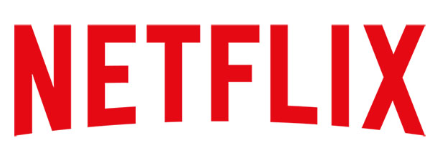
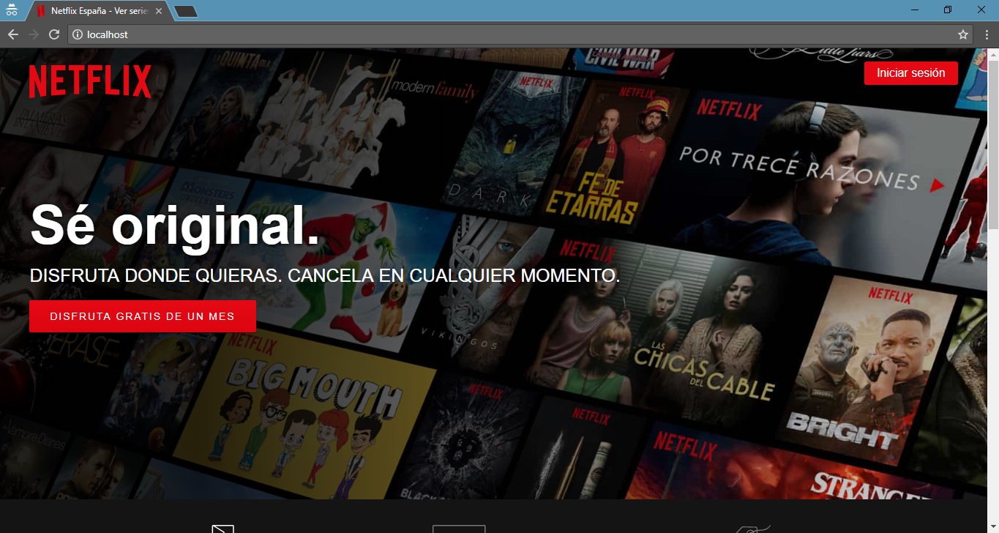
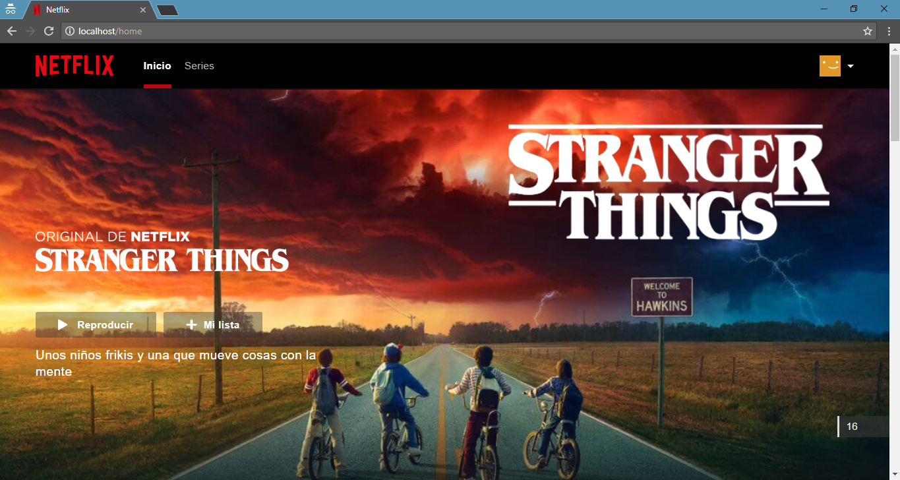
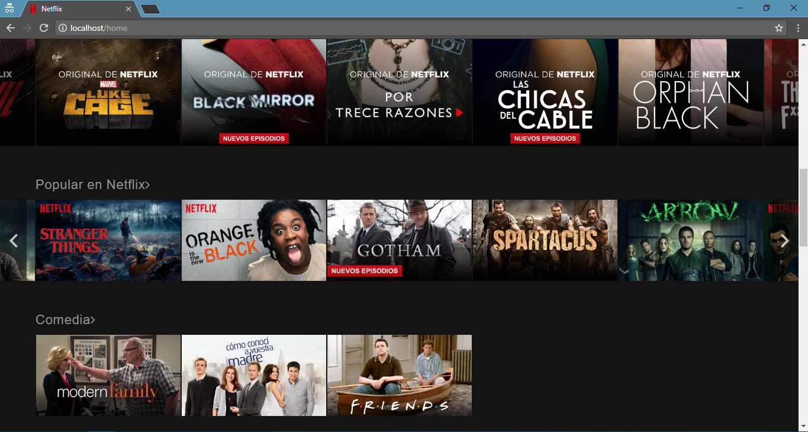
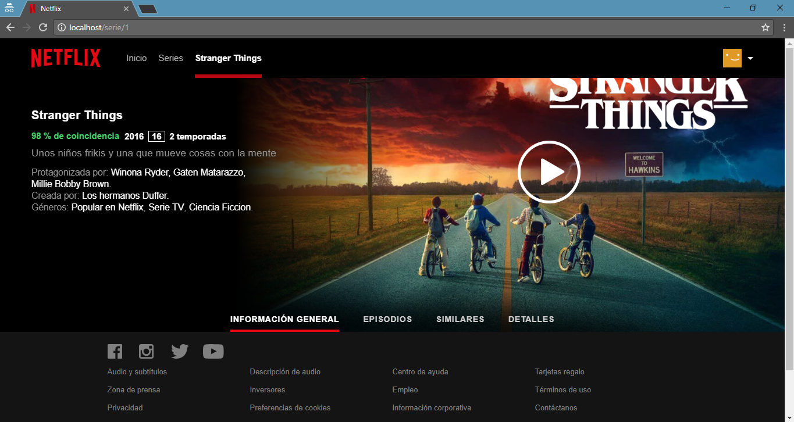
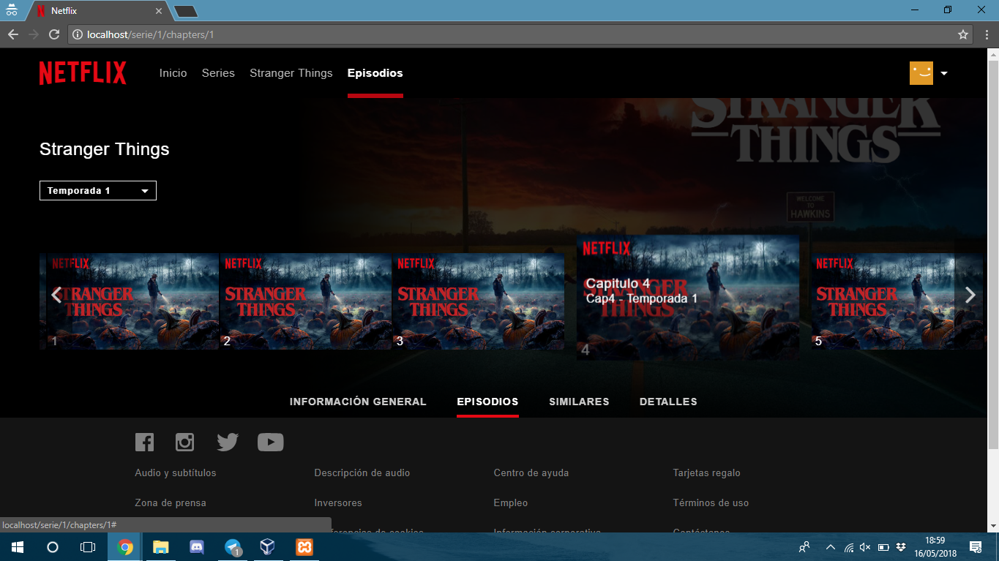
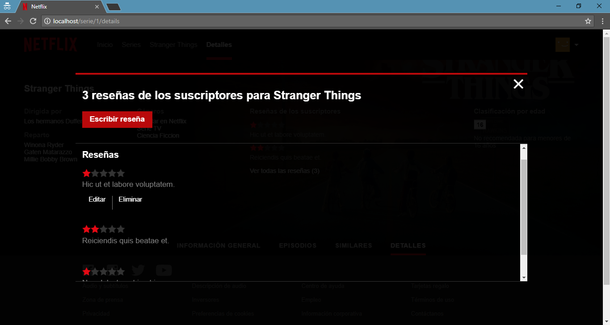
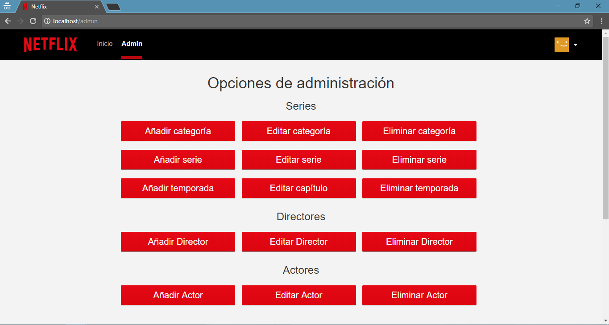

<p align="center"></img></p>

# Netflix &nbsp; </img> </img>

Esta práctica es una copia visual de la pagina [Netflix](https://www.netflix.com/), una página que ofrece una tarifa plana mensual de contenido multimedia (principalmente, películas, series de televisión) y documentales bajo demanda por Internet.

Para esta práctica se ha utilizado el Framework PHP Laravel, con Bootstrap + CSS + JQuery + JavaScrypt. Parte del CSS utilizado es de la página oficial, pero ha tenido que ser adaptado para hacerlo funcionar correctamente. Todo el JS y JQuery utilizado no ha podido ser reutilizado de la página oficial.

<p align="center"></img></p>

## Guía de instalación

Siga estas instrucciones para obtener una copia de este proyecto funcionando correctamente en tu sistema operativo.

### Prerrequisitos
<p align="center"></p>

Al ser un proyecto realizado con [Laravel](https://laravel.com/), necesitaremos todo lo necesario para ejecutar uno. Como podría ser PHP, Composer, etc.

### Instalando y ejecutando Netflix

Para poner en marcha este proyecto habrá que instalar las dependencias, lanzar las migraciones (y seeders) y poner en funcionamiento el servidor HTTP con el comando:
```
$ composer install
```

```
$ php artisan migrate:refresh --seed
```

```
$ php artisan serve
```

A continuación se muestran una serie de capturas de la aplicación lograda:
<p align="center"></img></p>
<p align="center"></img></p>
<p align="center"></img></p>
<p align="center"></img></p>
<p align="center"></img></p>

## Funcionalidades

* Registro + Login de usuarios
* Listado series
    * Página principal
    * Por categorías (Comedia, drama...)
* Ver detalles de una serie
    * Título
    * Descripcion
    * Año
    * Directores, actores, etc.
* Listado capítulos de una serie (por cada temporada)
* Escribir, editar y eliminar reseñas
* Opciones del administrador
    * CRUD Categorías
    * CRUD Series
    * CRUD Temporadas
    * CRUD Directores
    * CRUD Actores

<p align="center"></img></p>

## Autores

* **Jonay Gilabert Lopez** - *Programador* - [Jonay](www.linkedin.com/in/jonay-gilabert-lópez-841a4815b)
* **Lawrence Rider García** - *Programador* - [Larry](http://www.larryrider.es)

Puedes ver también la lista de los [contribuidores](https://github.com/larryrider/Netflix/contributors) que han participado en este proyecto.

## Licencia

Este proyecto está bajo la licencia GNU GPL v3 - revisa [LICENSE](LICENSE) para ver más detalles.

Laravel es un software de código abierto bajo la licencia [MIT license](http://opensource.org/licenses/MIT).